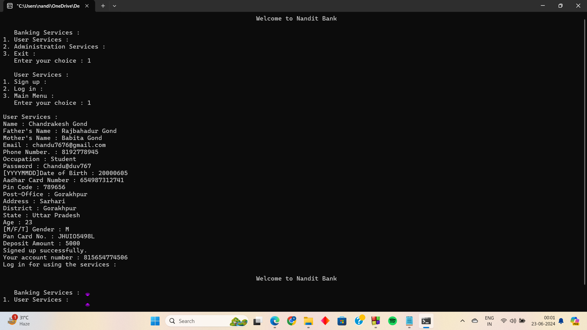
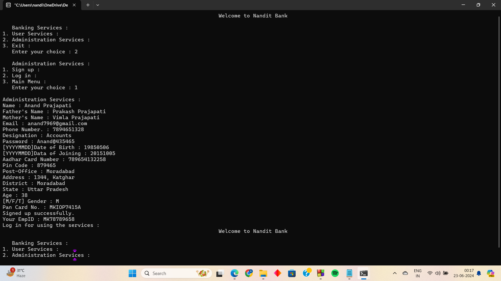
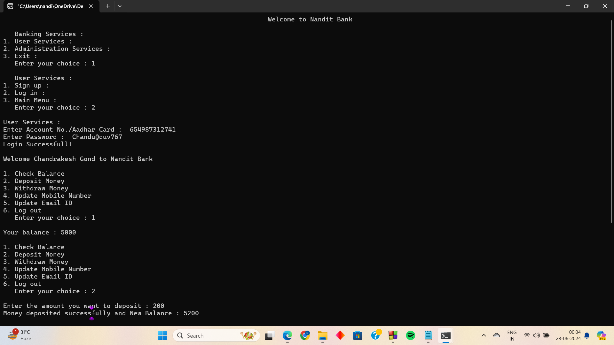
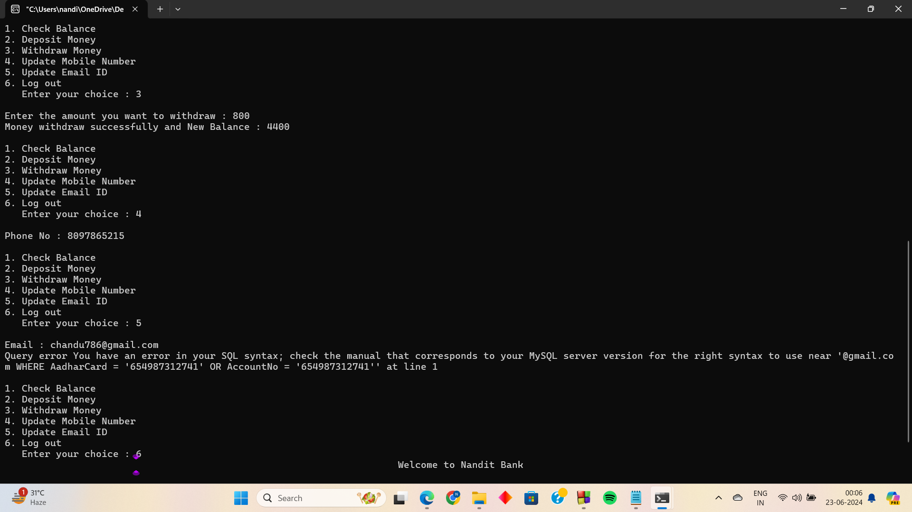
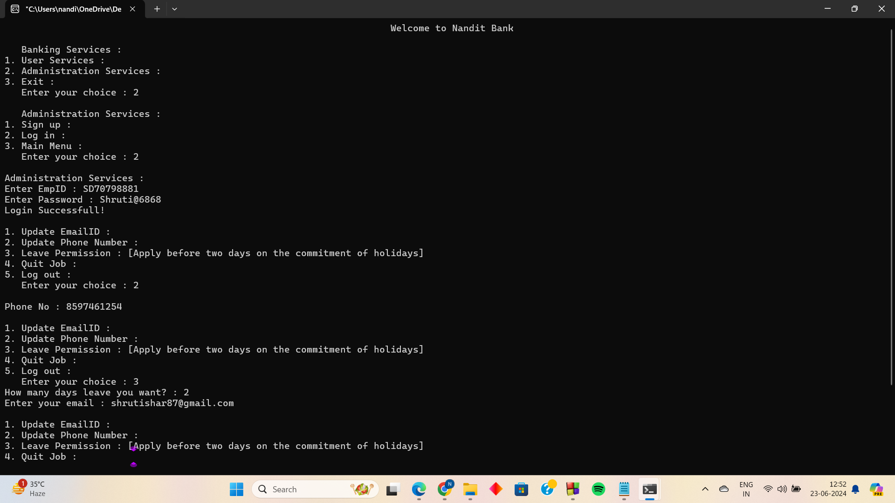
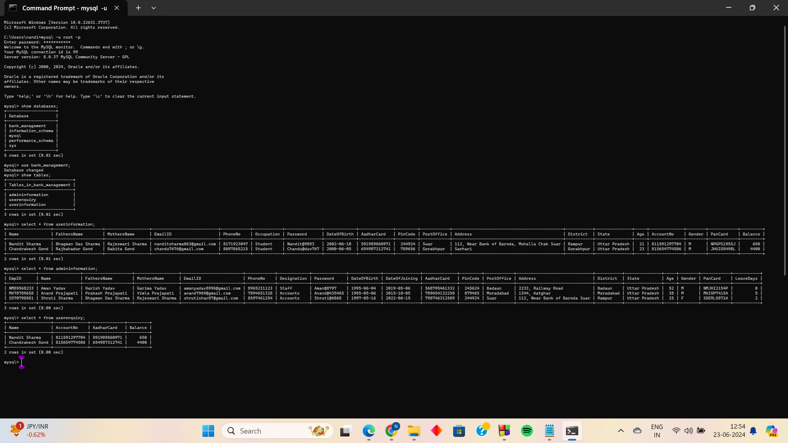

# Bank Mangement System
This program is based on a bank management system using the C++ programming language for the backend and MySQL database for storing data. It includes various functionalities for both users and bank employees, such as login, signup, updating information, etc.

## C++
C++ is a powerful and versatile programming language widely used for developing system software, application software, device drivers, embedded software, and games, among other things. It was developed by Bjarne Stroustrup at Bell Labs in the early 1980s as an extension of the C programming language. C++ provides a combination of high-level features, enabling object-oriented programming (OOP), generic programming, and low-level memory manipulation

## Object-Oreinted Programming
- **Inheritance**: The process of inheriting properties and behavior from an existing class into a new class. There are different types of inheritance methods such as single, multilevel, multiple, hierarchical, and hybrid. It includes three visibility modes: private, public, and protected, each affecting accessibility and availability features.
- **Encapsulation**:  is a fundamental principle of object-oriented programming (OOP) that involves bundling the data (properties) and methods (functions or procedures) that operate on the data into a single unit, known as a class. This concept allows the class to control the access to its data, preventing direct modification by external code and ensuring that the integrity of the data is maintained.
- **Data Hiding**: The internal state of an object (its data members) is hidden from the outside world, and access to it is restricted to methods defined within the class. This prevents unintended or unauthorized manipulation of the object's data.
- **Abstraction**:Encapsulation allows objects to present a simplified and consistent interface to the outside world, hiding complex implementation details. This promotes easier and safer usage of objects without needing to understand their internal workings.
- **Polymorphism**:It refers to the ability of different objects to respond to the same message (method call) in different ways. It allows objects of different classes to be treated as objects of a common superclass, but still behave according to their own class-specific implementation.
## User Sign up

## Admin Sign up

## User Log in

## Admin Log in

## Database Tables

